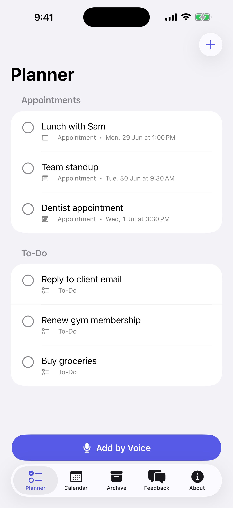

# Tertiary Planner — AI To-Do & Planner for iOS

A native iOS app for managing **to-dos and appointments by voice or touch**. Speak naturally —
*"Lunch with Sam tomorrow at 1pm"* — and on-device intelligence turns it into a scheduled
appointment; *"Buy groceries"* becomes a to-do. Appointments appear in a built-in calendar,
checked items auto-archive, and everything can sync to your personal iCloud.

<a href="https://apps.apple.com/app/tertiary-planner/id6785397240">
  
</a>

> **Tertiary Planner** is available on the
> [App Store](https://apps.apple.com/app/tertiary-planner/id6785397240). Version 1.0 ships with
> on-device storage; **iCloud sync** (already implemented in the codebase) is enabled in a v1.1
> update once the CloudKit container provisioning is finalized.



## Features

- 💬 **Assistant chat** — the app's front door: tell the assistant what you need, by text or
  voice, and it drafts a nicely worded to-do or appointment and saves it instantly (with undo).
- 🍎 **Apple Intelligence on-device** — on iOS 26+ devices with the system model available, the
  assistant uses Apple's FoundationModels framework to classify and word entries; everywhere
  else it falls back to the deterministic parser. Both paths are fully local.
- ✅ **To-dos & appointments in one list** — add either from a single, smart form.
- ✏️ **Tap to edit** — tap any item in the Planner or Calendar to fix a typo or change its
  title, notes, type, or date in the same form used to create it.
- 🎙️ **Voice capture** — tap the mic, speak, and native iOS speech-to-text transcribes it.
- 🧠 **On-device "AI" parsing** — detects dates/times, classifies task vs. appointment, and
  cleans up the title automatically (no network, fully private).
- 📅 **Built-in calendar** — appointments show on a graphical month calendar with per-day and
  upcoming lists.
- 📥 **Auto-archive** — checking off an item moves it to the Archive automatically; uncheck to
  restore.
- ☁️ **iCloud sync** — SwiftData + CloudKit mirrors your data to your private iCloud database
  across all your devices.
- 💬 **Feedback & About** — house-style tabs (WhatsApp feedback, developer info, version).

## Tech Stack


- **UI:** SwiftUI, Human Interface Guidelines, SF Symbols, Dynamic Type, dark-mode theming.
- **Persistence & sync:** SwiftData with automatic CloudKit mirroring (private database).
- **Voice:** `SFSpeechRecognizer` + `AVAudioEngine` (prefers on-device recognition); the audio
  engine is created lazily so no microphone prompt appears until dictation is actually used.
- **Intelligence:** `IntentAssistant` uses Apple's on-device **FoundationModels** (Apple
  Intelligence, iOS 26+) for intent classification and title wording, falling back to
  `SmartParser` (`NSDataDetector` + `NaturalLanguage`). Dates always come from the
  deterministic parser so clock math never hallucinates.
- **Project:** generated from `project.yml` via [XcodeGen](https://github.com/yonaskolb/XcodeGen).

## Architecture

```
PlannerApp/
├── App/        PlannerApp.swift        — @main, SwiftData + CloudKit container
├── Models/     PlannerItem.swift       — single CloudKit-safe model (task | appointment)
├── Services/   IntentAssistant.swift   — on-device Apple Intelligence drafting (iOS 26+)
│               SmartParser.swift       — deterministic date/time + intent parsing
│               SpeechRecognizer.swift  — native speech-to-text
├── Theme/      Theme.swift             — central color tokens (auto dark mode)
└── Views/      MainTabView, AssistantChatView, TodoListView, CalendarView,
                ArchiveView, AddItemView, VoiceCaptureView, ItemRow,
                FeedbackView, AboutView
```

## Getting Started

```bash
# Requirements: Xcode 16+ (iOS 17 SDK), XcodeGen (brew install xcodegen)
xcodegen generate
open PlannerApp.xcodeproj
```

Build & run on the **iPhone 17 Pro** simulator, or select your device.

### Enabling iCloud sync on a device

The default device build installs with **local storage**. To turn on iCloud sync:

1. In Xcode → **Settings → Accounts**, add your Apple ID (Apple Developer Program team).
2. Select the **PlannerApp** target → **Signing & Capabilities**; Xcode registers the
   **iCloud** + **Push Notifications** capabilities declared in `PlannerApp.entitlements`
   and creates the `iCloud.com.tertiaryinfotech.plannerapp` container.
3. Ensure `CODE_SIGN_ENTITLEMENTS` points at `PlannerApp/PlannerApp.entitlements` in `project.yml`,
   then rebuild.

## Permissions

The app requests **Microphone** and **Speech Recognition** access only when you first use voice
capture. Transcription prefers Apple's on-device engine where supported.

## Acknowledgements

Developed by **Tertiary Infotech Academy Pte Ltd** — [tertiaryinfotech.com](https://www.tertiaryinfotech.com)

---

🤖 Built with [Claude Code](https://claude.com/claude-code)
