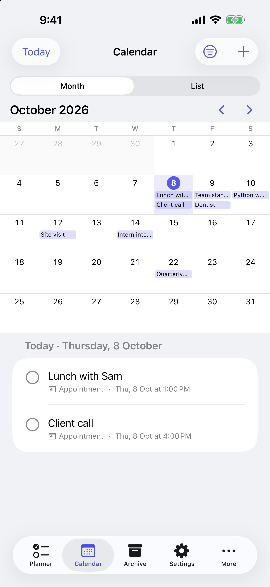

# Tertiary Planner — AI To-Do & Planner for iOS & macOS

A native iOS + macOS app for managing **to-dos and appointments by voice or touch**. Speak
naturally — *"Lunch with Sam tomorrow at 1pm"* — and on-device intelligence turns it into a
scheduled appointment; *"Buy groceries"* becomes a to-do. See every appointment written into a
month calendar (with Singapore public holidays marked), check what's **Upcoming** day by day,
get a morning summary of today's appointments, and organize everything into your own lists —
all synced across your iPhone and Mac through your personal iCloud, with full undo.

<a href="https://apps.apple.com/app/tertiary-planner/id6785397240">
  
</a>
&nbsp;
<a href="https://github.com/alfredang/plannerapp/releases/latest/download/Planner.dmg">
  
</a>

> **iPhone / iPad:** get it on the
> [App Store](https://apps.apple.com/app/tertiary-planner/id6785397240).
> **Mac:** [download the DMG](https://github.com/alfredang/plannerapp/releases/latest/download/Planner.dmg),
> open it, and drag **Planner** onto **Applications** — no App Store needed. Both apps sync
> through the same private iCloud database.



## Features

- 🗓️ **One Planner page, two tabs** — **To-Do** (All Tasks · Pinned Tasks) and **Appointment**
  (Today · Upcoming) sit as top tabs on a single page, so a list never mixes the two kinds.
- ⏭️ **Upcoming, by date** — everything with a date, broken down into **Today**, **Tomorrow**
  and each day after, with anything overdue gathered on top. Same view on the Mac sidebar.
- 📅 **Month calendar** — each day's appointments are written right into the grid (with times
  on iPad and Mac), the selected day's agenda sits underneath, and a **List** view shows every
  appointment grouped by day, opened at today. Swipe (iPhone) or use the arrows to change
  month; long-press (iPhone) or double-click (Mac) a day to add an appointment there.
- 🇸🇬 **Singapore public holidays** — marked in red on the calendar with their names,
  including the observed Monday when a holiday falls on a Sunday. Dates come from the
  [Ministry of Manpower list](https://www.mom.gov.sg/employment-practices/public-holidays)
  (2025–2027), bundled so the calendar works offline.
- ⏰ **Today's appointments alert (iPhone)** — a morning summary of the day's appointments
  (8 am by default, adjustable; quiet days stay quiet) plus an alert just before each of your
  own appointments (15 minutes by default, or at start / 5 / 30 / 60 minutes / off).
- 🔔 **Advance reminders** — a heads-up before anything with a date is due: 3 days ahead by
  default, or 1 day / 1 week. All alerts are local notifications, re-armed whenever items
  change (including iCloud edits from another device) and shown even while the app is open.
- 🎨 **Choose your look (iPhone)** — Light, Dark or System appearance, and eight accent
  colours (Indigo, Red, Blue, Green, Orange, Purple, Pink, Teal) in Settings ▸ Appearance.
  The Mac has its own Light/Dark toggle (⇧⌘D) and default in Settings.
- 💬 **Capture bar** — a chatbot-style bar at the bottom of the Planner: type or dictate what
  you need and the assistant drafts a nicely worded entry and saves it instantly; the new row
  is the feedback, and the toolbar Undo takes it back.
- 🍎 **Apple Intelligence on-device** — on iOS/macOS 26+ devices with the system model, the
  assistant uses Apple's FoundationModels framework to classify and word entries; everywhere
  else it falls back to the deterministic parser. Both paths are fully local. Dates always
  come from the deterministic parser, and a date on a to-do is a deadline, not a promotion
  to appointment.
- ✍️ **Typo-tolerant titles** — the assistant fixes spelling as it writes an item
  ("sumit ato" → "Submit ATO"), but never adds words you didn't type.
- 🎙️ **Voice capture** — tap the mic, speak, and native speech-to-text transcribes it.
- ✏️ **Tap to edit** — tap any item to change its title, notes, type, date, list or assignee
  in the same form used to create it.
- 🔎 **Search** — find anything active by keyword across titles, notes, assignee and list
  name; words match in any order. Archived items are never searched.
- 👯 **Duplicate check** — spots the same title on the same day and offers to archive the
  extra copies, keeping the original. Multi-day courses (same title, different days) are
  left alone.
- 🗂 **Your own lists and sub-lists** — create, rename, nest and delete lists ("Clients" ▸
  each client); a parent list shows its own items plus everything in its sub-lists. Move an
  item to another list from its menu (iPhone) or by dragging it onto the sidebar (Mac).
- 🔽 **Collapse & expand** — fold a group shut with its chevron, or collapse/expand every
  list at once from the Mac sidebar or the Manage Lists toolbar on iPhone.
- ↕️ **Drag to rearrange** — hold and drag to-dos, appointments and lists into any order; the
  custom order syncs across devices.
- 🚩 **To-Do priorities** — mark a to-do **Critical, High, Medium or Low** from the edit form
  or its menu; to-dos sort by priority, and Critical and High are **pinned automatically**
  (lowering them unpins). Coloured badges show the level; the Hermes agent can set it too.
- 📌 **Pin to top** — tap the pin on a row (or swipe right on iPhone); pinned entries float
  above the rest, and the **Pinned** view collects them.
- 👤 **Delegate with Assign to** — put someone's name on an item and it leaves your queue:
  the smart views show only your own work (unassigned, or assigned to you), while that
  person's list shows theirs. Set who "you" are in Settings ▸ Me.
- 📆 **Mirror to your system Calendar** — optionally copy dated appointments into any calendar
  you pick, including a Google account added in iOS Settings; EventKit only, off until enabled.
- 📥 **Auto-archive** — checking off an item moves it to the Archive; uncheck to restore.
- ↩️ **Undo everywhere** — ⌘Z on the Mac, the Undo toolbar button on iPhone.
- ☁️ **iCloud sync** — SwiftData + CloudKit mirrors your data to your private iCloud database
  across iPhone, iPad and Mac, with a live sync status, last-sync time and **Sync Now** in
  Settings (plus pull-to-refresh on iPhone).
- 🖥 **macOS desktop edition** — a two-column Mac app: smart views (To-Do, Pinned, Today,
  Upcoming, Appointments, Calendar) and your lists in the sidebar, the item list with the
  capture bar on the right. Distributed as a
  [DMG](https://github.com/alfredang/plannerapp/releases/latest/download/Planner.dmg); build it
  yourself with `./scripts/build-macos-dmg.sh`.
- 💚 **WhatsApp digests (Mac)** — today's appointments at 8 am and tomorrow's at 3 pm (times
  adjustable), sent automatically through the Hermes WhatsApp bridge or opened in WhatsApp
  for you to send. Set the recipient number in Settings — none is built in.
- 🤖 **Hermes agent terminal (Mac)** — a collapsible right-hand panel (⌥⌘T) embeds a real
  terminal ([SwiftTerm](https://github.com/migueldeicaza/SwiftTerm)) that auto-starts the
  [Hermes Agent](https://hermes-agent.nousresearch.com) CLI. Ask it in plain language —
  *"add buy milk tomorrow"*, *"move the n8n task to AI-LMS-TMS"*, *"mark it done"* — and it
  edits your planner through a local command bridge (a file inbox the open window answers),
  reading live state from an auto-maintained JSON snapshot. **The agent cannot delete your
  data by default:** `delete` archives instead and deleting a list is refused; opt in via
  Settings ▸ Agent safety.
- 💬 **Feedback & About** — house-style tabs (WhatsApp feedback, developer info, version).

## Tech Stack


- **UI:** SwiftUI, Human Interface Guidelines, SF Symbols, Dynamic Type; user-selectable
  Light/Dark/System appearance and accent colour.
- **Persistence & sync:** SwiftData with automatic CloudKit mirroring (private database).
- **Voice:** `SFSpeechRecognizer` + `AVAudioEngine` (prefers on-device recognition); the audio
  engine is created lazily so no microphone prompt appears until dictation is actually used.
- **Intelligence:** `IntentAssistant` uses Apple's on-device **FoundationModels** (Apple
  Intelligence, iOS 26+) for intent classification and title wording, falling back to
  `SmartParser` (`NSDataDetector` + `NaturalLanguage`). Dates always come from the
  deterministic parser so clock math never hallucinates.
- **Notifications:** `UserNotifications` local alerts only — advance reminders, the morning
  summary and per-appointment alerts, kept under iOS's 64-pending-request limit.
- **Project:** generated from `project.yml` via [XcodeGen](https://github.com/yonaskolb/XcodeGen).
  The app icons are drawn by `scripts/icon/make_icon.py` (Pillow).

## Architecture

```
PlannerApp/                             — iOS app + code shared with the Mac target
├── App/        PlannerApp.swift        — @main, SwiftData + CloudKit container,
│                                         foreground notification presenter
├── Models/     PlannerItem.swift       — CloudKit-safe model (task | appointment)
│               PlannerList.swift       — user-created list (items kept on delete)
│               PlannerCategory.swift   — smart views (To-Do, Pinned, Today, Upcoming…)
│               DaySections.swift       — Upcoming's by-date grouping (Overdue first)
│               SingaporeHolidays.swift — MOM public-holiday table for the calendars
│               ManualOrder.swift       — synced drag-rearrange ordering helper
│               ListHierarchy.swift     — nested sub-list outline + drag-to-nest logic
│               ChatMessage.swift       — assistant conversation turn
├── Services/   IntentAssistant.swift   — on-device Apple Intelligence drafting (26+)
│               SmartParser.swift       — deterministic date/time + intent parsing
│               SpeechRecognizer.swift  — native speech-to-text (cross-platform)
│               ReminderScheduler.swift — advance "N days before" alerts; rebuilds all alerts
│               TodayAlerts.swift       — morning summary + alert before each appointment
│               CalendarSync.swift      — mirrors appointments into the system Calendar
│               CloudSyncStatus.swift   — iCloud account + last-sync status, Sync Now
│               PlannerCommand.swift    — assistant command router (15 verbs, on-device)
│               DuplicateAudit.swift    — same-title-same-day duplicate detection
│               ModelUndoSupport.swift  — system undo/redo for all SwiftData changes
├── Theme/      Theme.swift             — colour tokens, accent themes, appearance choice
└── Views/      MainTabView, TodoListView (Planner: To-Do | Appointment), CalendarView
                (month grid + list), ArchiveView, AddItemView, ListsManagerView
                (+ ListDetailView), RemindersSettingsView (Settings), ItemRow,
                VoiceCaptureView, AssistantChatView (not currently shown), FeedbackView,
                AboutView

PlannerAppMac/                          — macOS desktop edition (DMG)
├── App/        PlannerMacApp.swift     — @main, same schema + iCloud container
├── Services/   HermesBridge.swift      — command bridge (file inbox/outbox) + JSON state
│                                         snapshot + Hermes skill/AGENTS.md workspace
│               WhatsAppReminders.swift — daily WhatsApp digests of appointments
│               AppearanceController.swift — Light/Dark/System for the Mac app
└── Views/      MacRootView.swift       — sidebar: smart views + user lists + sync badge
                MacPlannerPane.swift    — item list (Upcoming by date) + capture bar
                MacCalendarPane.swift   — month grid / list calendar with holidays
                MacTerminalPanel.swift  — collapsible SwiftTerm panel running hermes
                MacSettingsPane.swift   — owner, appearance, WhatsApp, agent safety

scripts/build-macos-dmg.sh              — Release build → signed, notarized DMG
scripts/icon/make_icon.py               — draws the iOS + Mac app icons
```

## Getting Started

```bash
# Requirements: Xcode 16+ (iOS 17 SDK), XcodeGen (brew install xcodegen)
xcodegen generate
open PlannerApp.xcodeproj
```

Build & run on the **iPhone 17 Pro** simulator, or select your device.

### Enabling iCloud sync on a device

The default device build installs with **local storage**. To turn on iCloud sync:

1. In Xcode → **Settings → Accounts**, add your Apple ID (Apple Developer Program team).
2. Select the **PlannerApp** target → **Signing & Capabilities**; Xcode registers the
   **iCloud** + **Push Notifications** capabilities declared in `PlannerApp.entitlements`
   and creates the `iCloud.com.tertiaryinfotech.plannerapp` container.
3. Ensure `CODE_SIGN_ENTITLEMENTS` points at `PlannerApp/PlannerApp.entitlements` in `project.yml`,
   then rebuild.

## Permissions

The app requests **Microphone** and **Speech Recognition** access only when you first use voice
capture (transcription prefers Apple's on-device engine), **Notifications** for the reminders
and today's-appointment alerts, and **Calendar** access only if you turn on calendar mirroring.

## Acknowledgements

Developed by **Tertiary Infotech Academy Pte Ltd** — [tertiaryinfotech.com](https://www.tertiaryinfotech.com)

---

🤖 Built with [Claude Code](https://claude.com/claude-code)
